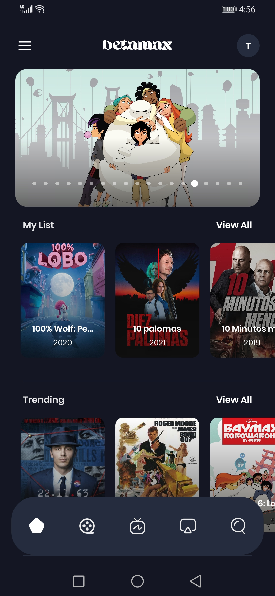
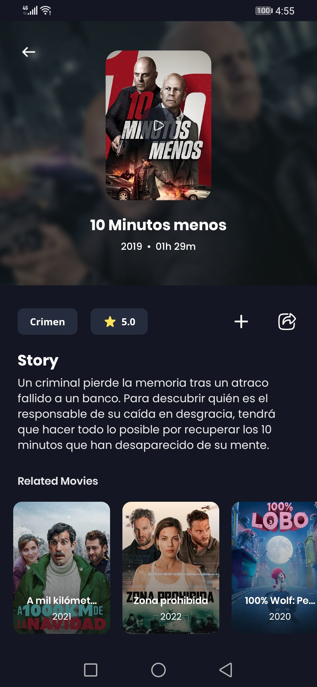
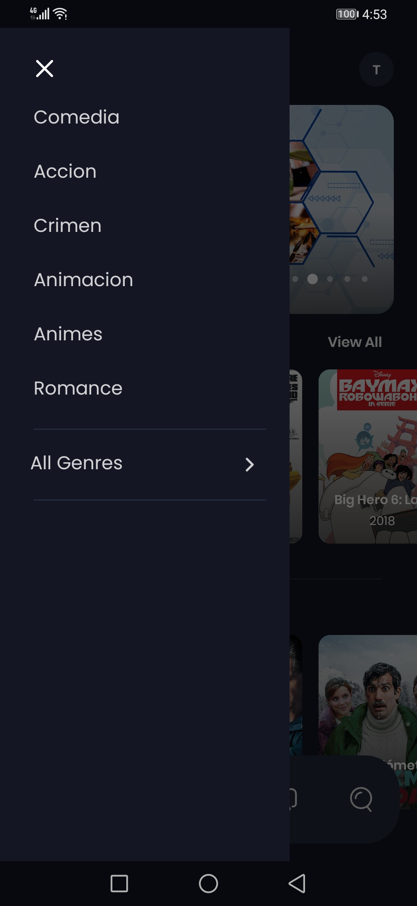
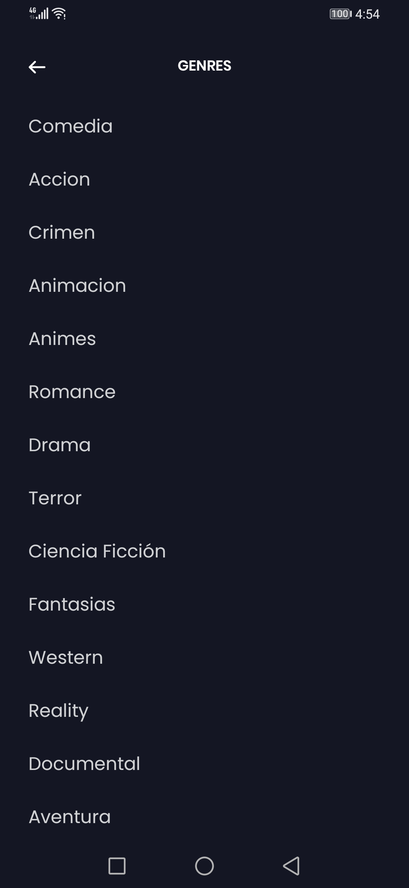
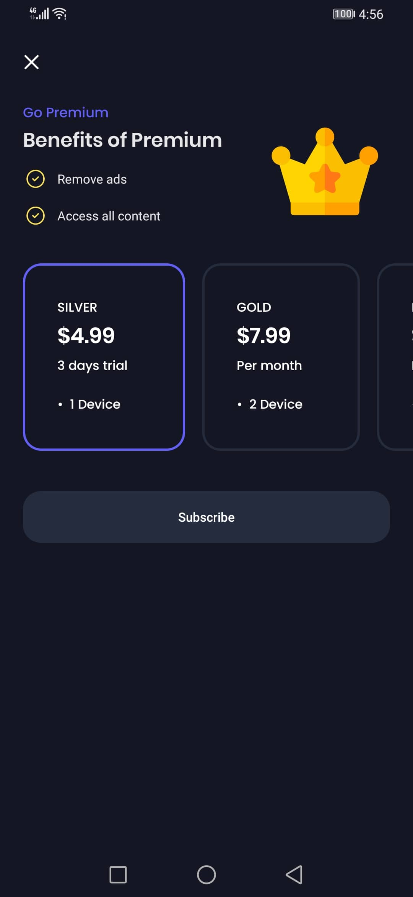
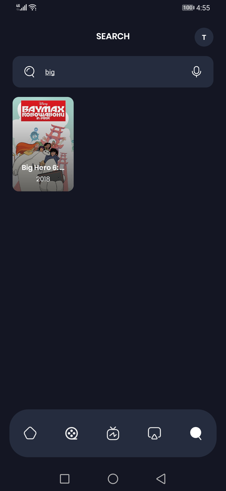

<!-- PROJECT LOGO -->
 

  
  <h3 align="center">Betamax</h3>
  

    Streaming app that allows members to watch movies, series, tv shows and its a subscription-based app.
     
    <a href="#"><strong>Download Demo »</strong></a>
  

<!-- ABOUT THE PROJECT -->
## About The Project

Streaming app that allows members to watch movies, series, tv shows and its a subscription-based app.

<!-- TECHNOLOGIES USED -->
## Technologies Used

* MVVM & Clean Architecture
* [Dagger-Hilt](https://dagger.dev/hilt/)
* [Kotlin Coroutines](https://developer.android.com/kotlin/coroutines)
* [Kotlin Flow](https://developer.android.com/kotlin/flow)
* [Retrofit](https://square.github.io/retrofit/)
* [GSON](https://github.com/google/gson)
* [DataStore](https://developer.android.com/topic/libraries/architecture/datastore)
* [Lottie](https://github.com/airbnb/lottie-android)
* [ExoPlayer](https://github.com/google/ExoPlayer)
* [OneSignal](https://onesignal.com/)
* [RecyclerView](https://developer.android.com/develop/ui/views/layout/recyclerview?gclsrc=ds)
* [ViewModel](https://developer.android.com/topic/libraries/architecture/viewmodel)
* [DataBinding](https://developer.android.com/topic/libraries/data-binding)
* [Shared Preferences](https://developer.android.com/training/data-storage/shared-preferences)
* [Google Billing Library](https://developer.android.com/google/play/billing/integrate)
* [Firebase Cloud Messaging](https://firebase.google.com/docs/cloud-messaging/android/client)
* [Crashlytics](https://firebase.google.com/products/crashlytics)

## Screenshots

